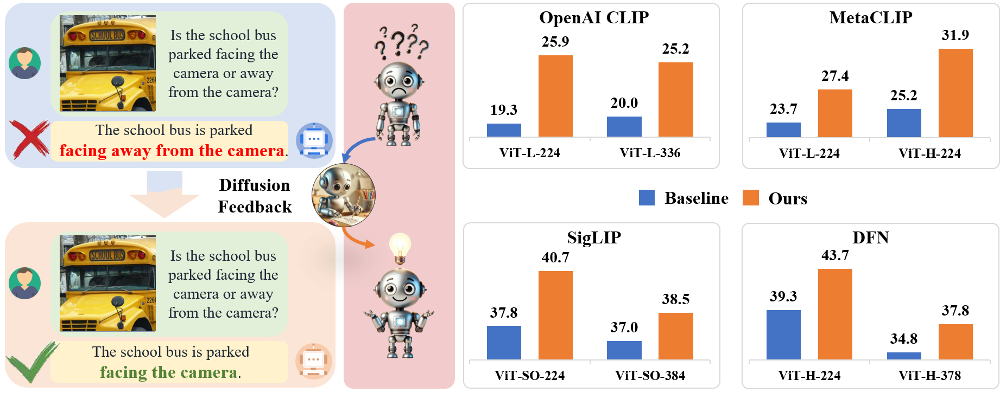

<div align='center'>

<h2><a href="https://arxiv.org/abs/2407.20171">Diffusion Feedback Helps CLIP See Better</a></h2>

[Wenxuan Wang](https://scholar.google.com/citations?user=75OyC-oAAAAJ&hl=zh-CN)<sup>1,2,3*</sup>, [Quan Sun](https://scholar.google.cz/citations?user=pVKiHdEAAAAJ&hl=zh-CN&oi=ao)<sup>3*</sup>, [Fan Zhang](https://scholar.google.cz/citations?hl=zh-CN&user=VsJ39HMAAAAJ&view_op=list_works&sortby=pubdate)<sup>3</sup>, [Yepeng Tang](https://scholar.google.cz/citations?user=CAC_4OUAAAAJ&hl=zh-CN&oi=ao)<sup>4</sup>, [Jing Liu](https://scholar.google.com/citations?user=sOI-S7oAAAAJ&hl=zh-CN)<sup>1,2</sup>, [Xinlong Wang](https://scholar.google.com/citations?hl=zh-CN&user=DPz0DjYAAAAJ&view_op=list_works&sortby=pubdate/)<sup>3</sup>
 
<sup>1</sup>[CASIA](http://english.ia.cas.cn/), <sup>2</sup>[UCAS](https://english.ucas.ac.cn/), <sup>3</sup>[BAAI](https://www.baai.ac.cn/english.html), <sup>4</sup>[BJTU](https://en.bjtu.edu.cn/) <br><sup>*</sup> Equal Contribution <br>


</div>


## ⏰ Schedule

[Coming Soon] We release [training & evaluation code](https://github.com/baaivision/DIVA) ! 💥   
[Coming Soon] We release [CLIP model weights](https://github.com/baaivision/DIVA) ! 💥  
[2024-07-30] Our [paper](https://arxiv.org/abs/2407.20171) is released on arXiv ! 💥


## 💡 Motivation

<p align="center">
    
</p>

In this work, we present a simple post-training approach for CLIP models, which largely overcomes its visual shortcomings via a self-supervised diffusion process. We introduce DIVA, which uses the DIffusion model as a Visual Assistant for CLIP. Specifically, DIVA leverages generative feedback from text-to-image diffusion models to optimize CLIP representations, with only images (w/o corresponding text). We demonstrate that DIVA improves CLIP's performance on the challenging MMVP-VLM benchmark which assesses fine-grained visual abilities to a large extent (e.g., 3-7% ↑), and enhances the performance of MLLMs and vision models on multimodal understanding and segmentation tasks. Extensive evaluation on 29 image classification and retrieval benchmarks confirms that DIVA preserves CLIP's strong zero-shot capabilities.


## 🤖 Architecture

<p align="center">
    
</p>

Given an image, the CLIP model encodes the visual features as the main part of condition, then the generative diffusion model predicts the added noise taking the noisy image and condition as input. We optimize the CLIP's representation by maximizing the image likelihood with the diffusion loss via generative feedback.


## 🔨 Installation
Clone this repository and install the required packages:

```shell
git clone https://github.com/baaivision/DIVA.git
cd DIVA

conda create -n diva python=3.9
conda activate diva
pip install -r requirements.txt

```
Core packages: 
- [Pytorch](https://pytorch.org/) version 2.0.0
- [open-clip-torch](https://github.com/mlfoundations/open_clip) version 2.24.0
- [timm](https://github.com/rwightman/pytorch-image-models) version 0.9.8


## 🎞 Visualization

<p align="center">
    
</p>


## 💙 Acknowledgement
DIVA is built upon the awesome [Diffusion-TTA](https://github.com/mihirp1998/Diffusion-TTA), [MMVP](https://github.com/tsb0601/MMVP), [OpenCLIP](https://github.com/mlfoundations/open_clip), [timm](https://github.com/huggingface/pytorch-image-models/). 

## 📝 Citation
```bib
@article{wang2024diffusion,
      title={Diffusion Feedback Helps CLIP See Better},
      author={Wang, Wenxuan and Sun, Quan and Zhang, Fan and Tang, Yepeng and Liu, Jing and Wang, Xinlong},
      journal={arXiv preprint arXiv:2407.20171},
      year={2024}
}
```
